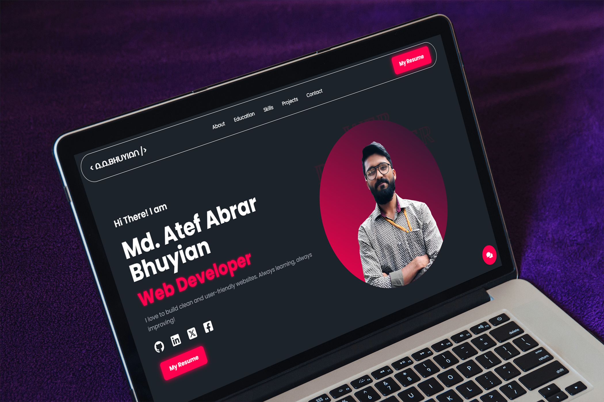

# Md. Atef Abrar Bhuyian — Portfolio

Welcome to my personal developer portfolio! I'm a passionate **MERN Stack Developer** focused on creating efficient, scalable, and user-friendly web applications. This site showcases my projects, skills, and the technologies I work with.

---

## 📸 Preview

## 🌐 Live Site

👉 [Visit My Portfolio](https://atef-abrar-bhuyian.netlify.app/)

---

## 🧠 About Me

I'm Md. Atef Abrar Bhuyian, a highly motivated and fast-learning web developer with a strong passion for modern web technologies. I specialize in building responsive, scalable, and user-centric applications using the MERN stack. With a focus on clean code, performance, and usability, I'm committed to continuous learning and staying up-to-date with the latest trends in web development.

## 💻 Technologies & Tools

I am comfortable working with a wide range of modern web development tools and technologies, including:

- **React.js** for dynamic and component-based frontend development
- **Node.js**, **Express.js**, and **MongoDB** for building robust backend APIs
- **Tailwind CSS** for creating sleek, responsive, and mobile-first UIs
- **React Router** for managing client-side routing in single-page applications
- **Firebase** for authentication, hosting, and real-time database integration
- **JWT (JSON Web Tokens)** for secure user authentication and authorization
- **GraphQL** for efficient data querying and flexible APIs
- **TanStack Query (React Query)** for powerful server-state management and caching
- **AI Integration** using APIs and tools like OpenAI and Gemini to enhance interactivity and automation
- Continuously learning and applying modern best practices in **full-stack development**

---